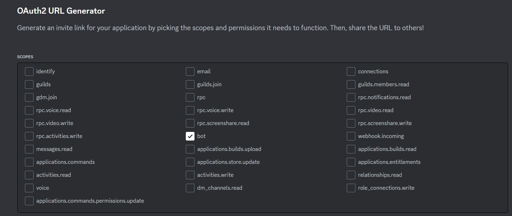

# Plex pinger

*Ping a Plex instance regularly, and send a message on a Discord channel if Plex instance is down*

---

## Presentation


This program is a Discord bot. It checks regularly if a Plex instance is up and running, meaning:

- The Plex server is running
- Pinger can retrieve video list from each library ("Movies", "Series"...) specified in the configuration file

If the Plex instance is down, the bot will send a message on a Discord channel. You can optionally specify Discord user to ping in the message.

## Pre-requisites

### Create a Discord bot

First of all you need to create a Discord bot, and invite it to a server with permissions to **send messages** and mention users.

To create a bot, visit [Discord developer portal](https://discord.com/developers/applications) and create a new application.

Under the "Bot" tab, create a new bot and copy its token.


Then, under the "OAuth2" tab, section "URL Generator", select "bot" in the "Scopes" section, and select "**Send messages**" and "**Mention everyone**" in the "Bot permissions" section.





Copy the generated URL and paste it in your browser, or send it to the server owner. You will be prompted to select a server to invite the bot to. Select a server and click "Continue".


### Get Discord UserID and ChannelID

First, you need to activate developer mode in Discord. Go to "User Settings" > "Advanced" > "Developer Mode" and activate it.


Then, right-click on channel name you want the bot to send messages to, and select "Copy ID". **This is the channel ID**.


**OPTIONAL**: If you want to mention a user in the message, right-click on the user name and select "Copy ID". **This is the user ID**.


### Get Plex instance information

In order to ping your Plex instance, the bot needs Plex address and credentials.

Here is the location of the information you need:

#### Windows

*(In the registry)*

` HKEY_CURRENT_USER\Software\Plex, Inc.\Plex Media Server`

#### MacOS

`~/Library/Preferences/com.plexapp.plexmediaserver.plist`

#### Linux

`$PLEX_HOME/Library/Application Support/Plex Media Server/Preferences.xml`

#### Debian, Fedora, Ubuntu, and CentOS

`/var/lib/plexmediaserver/Library/Application Support/Plex Media Server/Preferences.xml`

---

Retrieve the following information:

- PlexOnlineToken
- CertificateUUID


List the libraries you want to ping ("Movies", "Series"...).


## Installation

#### Compile from source

Install the Rust toolchain from https://rustup.rs/.

```bash
git clone https://github.com/thomasarmel/plex_pinger.git
cd plex_pinger
cargo build --release
```

The binary is located in `target/release/plex_pinger`. (`.exe` on Windows)


Create the **config.json** file:

```json
{
  "plex": {
    "domain": "[your plex instance domain]",
    "ssl": [boolean, do you want to use SSL? (recommended)],
    "port": [Plex default port, as integer. If you didn't change it, it should be 32400],
    "plex_token": "[your PlexOnlineToken]",
    "certificate_uuid": "[your CertificateUUID]",
    "libraries": [
      "Movies",
      "Series"
    ] // <-- List the libraries you want to ping
  },
  "discord_bot": {
    "bot_token": "[your Discord bot token]",
    "msg_channel_id": [Discord channel ID where the bot will send messages, as integer],
    "ping_user_id": [Optional: Discord user ID to ping, as integer]
  },
  "pinger_interval_seconds": [interval between each check ping, as integer],
  "pinger_reminder_seconds": [interval between each reminder ping, as integer]
}
```

And finally run the program:

```bash
./target/release/plex_pinger config.json
```

If you prefer, you would rather turn the pinger into a service:

#### Linux systemd based distributions:

https://medium.com/@benmorel/creating-a-linux-service-with-systemd-611b5c8b91d6

#### Windows:

https://www.ibm.com/docs/en/spectrum-protect/8.1.0?topic=systems-windows-manually-creating-configuring-windows-service

#### MacOS:

https://developer.apple.com/library/archive/documentation/MacOSX/Conceptual/BPSystemStartup/Chapters/CreatingLaunchdJobs.html